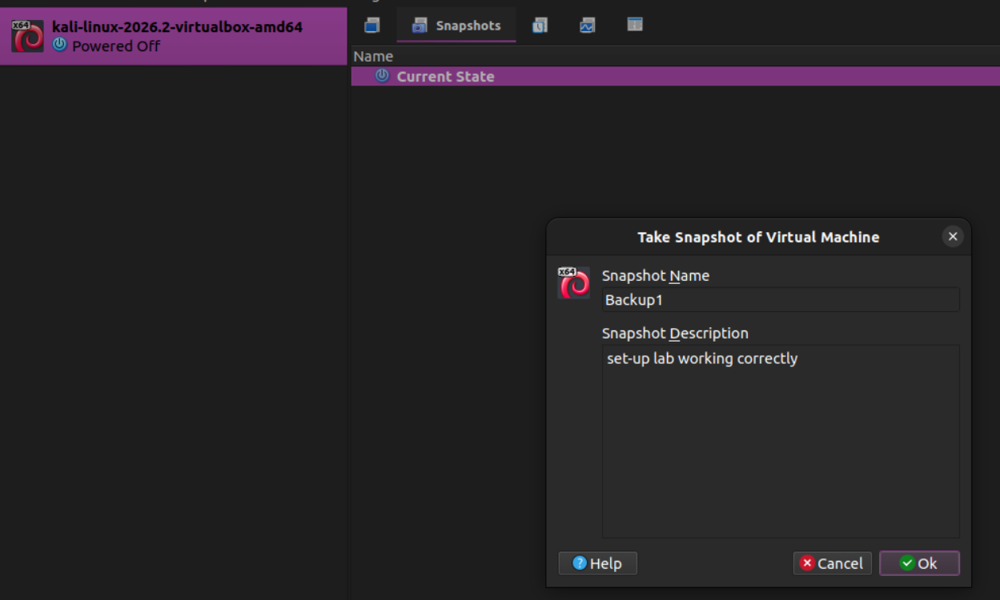

# 🔐 Cybersecurity Lab Setup

## Overview
Building an isolated virtual lab for penetration testing and ethical hacking practice using VirtualBox and Kali Linux. 
It can be used for activities such as: Network Footprinting, Port Scanning, Security Testing, and experimentation.

## Lab Architecture

## Steps
1. **Installing 7-Zip:** To extract the Kali Linux virtual machine package.
2. **Installing VirtualBox.**
3. **Configuring VirtualBox NAT network to 10.0.0.0/24**
   * IPv4 Prefix: 10.0.0.0/24
   * DHCP: Enabled
   * IPv6: Disabled
4. **Installing Kali Linux virtual machine**
   * Directly using the `.vbox` file.
   * Set the network adapter to "NAT Network" and not just "NAT" because the latter will be set for the host machine.
   
   

5. **Configuring Kali Linux IP address**
   * Right-click on the internet connection icon -> Edit Connection -> IPv4 -> Change method to Manual.
   
   

6. **Validation & connection testing**
7. **Creating a snapshot of the virtual machine**
   
   

## Notes
* If you can't find Network Settings, switch to Expert Mode using the shortcut `Ctrl+H`.
* NAT "Network Address Translation" is a virtual switch process used by routers to let multiple devices on a private local network share a single public IP address to access the internet.
  * *Advantage:* virutal machiens are used in isolation from the host machine.

## Ethical Use
This Lab is intended for educational purposes only.
